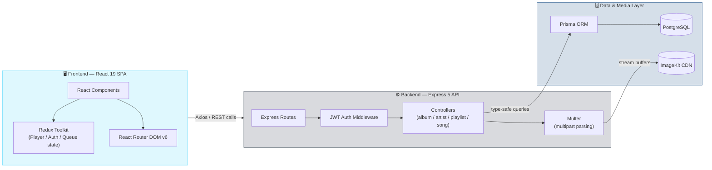
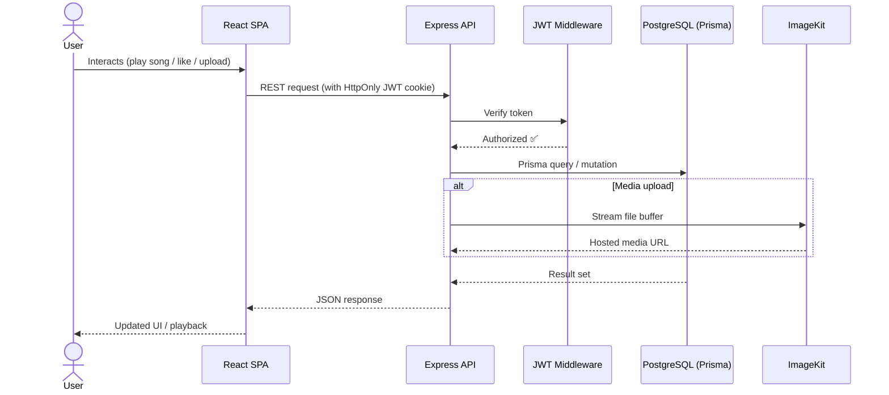

<div align="center">

# 🎧 Echo Beat

### A Modern, Full-Stack Audio Streaming Platform

[](https://www.typescriptlang.org/)
[](https://react.dev/)
[](https://tailwindcss.com/)
[](https://expressjs.com/)
[](https://www.prisma.io/)
[](https://www.postgresql.org/)

[Overview](#-project-overview) •
[Features](#-core-features) •
[Architecture](#️-architecture) •
[Tech Stack](#-tech-stack) •
[Setup](#-installation--setup) •
[Engineering Notes](#-engineering-highlights--decisions)

</div>

---

## 📖 Project Overview

**Echo Beat** is a highly scalable, premium web application architected to deliver a seamless audio streaming experience. Built on a modern MERN-like stack — with MongoDB replaced by a strictly typed **PostgreSQL** database — it's a showcase of senior-level engineering, clean folder architecture, and performant data delivery.

It skips the clutter of typical starter kits and instead offers a beautifully organized, end-to-end type-safe implementation of a genuinely complex domain: **music streaming**.

---

## ⚡ Core Features

| Feature | Description |
|---|---|
| 🔐 **Robust Authentication** | Secure JWT-based auth flow with HTTP-only cookies + Bcrypt password hashing |
| 🔗 **Relational Data Mastery** | Complex Many-to-Many & One-to-Many relationships via Prisma (Albums ↔ Artists, Users ↔ Liked Songs) |
| ☁️ **Media Management** | Direct-to-cloud uploads using Multer + ImageKit for audio & high-res imagery |
| 🎵 **Playlist & Library Ecosystem** | Full CRUD for user playlists, liked songs, and album curation |
| ⚙️ **Race Condition Prevention** | DB-level uniqueness constraints guaranteeing atomic ops on high-traffic endpoints |

---

## 🏗️ Architecture

The application is cleanly decoupled into two independent environments — a stateless Express API and a Vite-powered React SPA — talking to PostgreSQL and ImageKit.



### Request Lifecycle



### Core Data Model

```mermaid
erDiagram
    USER ||--o{ PLAYLIST : creates
    USER ||--o{ LIKEDSONG : likes
    ARTIST ||--o{ ALBUM : releases
    ARTIST }o--o{ SONG : performs
    ALBUM ||--o{ SONG : contains
    PLAYLIST }o--o{ SONG : includes
    SONG ||--o{ LIKEDSONG : "liked as"

    USER {
        string id PK
        string email
        string passwordHash
    }
    ARTIST {
        string id PK
        string name
    }
    ALBUM {
        string id PK
        string title
        string artistId FK
    }
    SONG {
        string id PK
        string title
        string audioUrl
        string albumId FK
    }
    PLAYLIST {
        string id PK
        string name
        string userId FK
    }
    LIKEDSONG {
        string userId FK
        string songId FK
        datetime createdAt
    }
